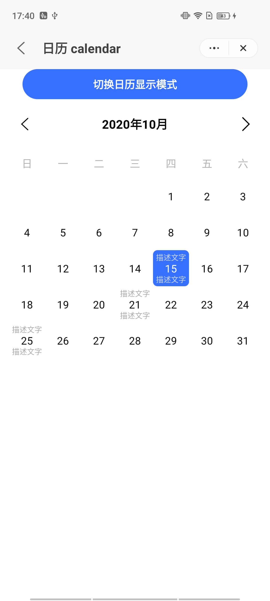
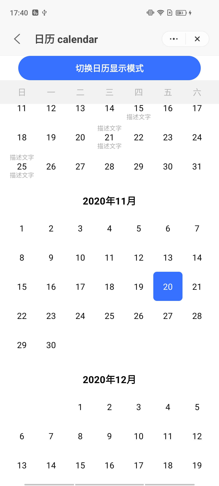

## 日历 calendar

### 描述

用于查看和选择日期。

### 使用效果

<div style="text-align: center;margin: 40px;">
    
    
</div>

### 使用方法

在`.ux`文件中引入组件

```html
<import name="q-calendar" src="qaui/src/components/calendar/index"></import>
```

### 示例

```html
<template>
  <div class="qaui-wrap">
    <q-button ontap="changeType">切换日历显示模式</q-button>
    <q-calendar
      if="type==='default'"
      type="default"
      description="{{desc}}"
    ></q-calendar>
    <q-calendar
      if="type==='list'"
      type="list"
      description="{{desc}}"
    ></q-calendar>
  </div>
</template>
```

```js
export default {
  data() {
    return {
      type: 'default',
      desc: [
        {
          date: '2020-10-15',
          top: '描述文字',
          bottom: '描述文字',
        },
        {
          date: '2020-10-21',
          top: '描述文字',
          bottom: '描述文字',
        },
      ],
    }
  },
  changeType() {
    this.type === 'default' ? (this.type = 'list') : (this.type = 'default')
    console.log(this.type)
  },
}
```

```less
.qui-wrap {
  flex-direction: column;
  align-items: center;
}
```

### API

#### 组件属性

| 属性        | 类型   | 默认值                | 说明                                |
| ----------- | ------ | --------------------- | ----------------------------------- |
| type        | String | 'default'             | 日历显示类型，可选值有 default,list |
| range       | Array  | ['2020-10','2021-10'] | 日历显示范围                        |
| description | Array  | []                    | 日期上显示相关描述文字              |
| desc.date   | String | ''                    | 要显示文字的日期，示例'2020-12-10'  |
| desc.top    | String | ''                    | 日期上面要显示的文字                |
| desc.bottom | String | ''                    | 日期下面要显示的文字                |

#### 组件事件

| 事件名称 | 事件描述 | 返回值             |
| -------- | -------- | ------------------ |
| tap      | 日期点击 | 当前点击日期的数据 |
