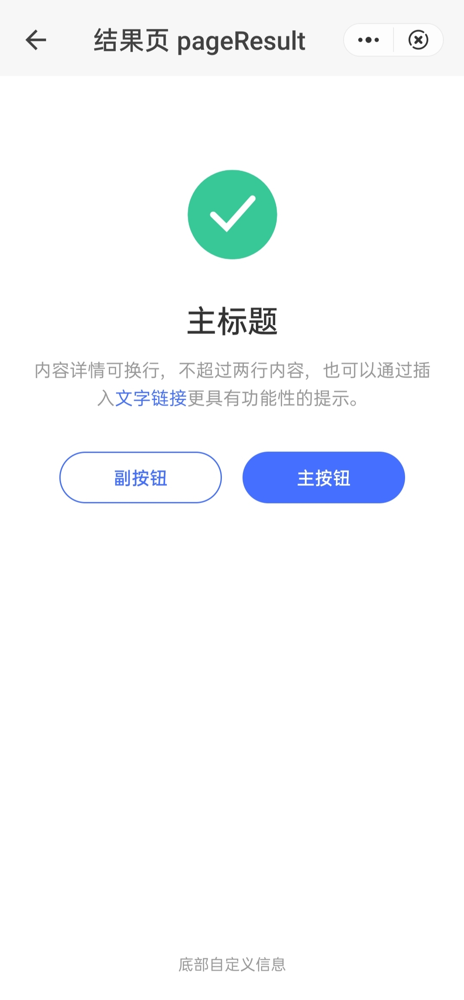

## 结果页 page-result

### 描述

用于展示一系列操作任务的处理结果页面。

### 使用效果

<div style="text-align: center;margin: 40px;"></div>

### 使用方法

在`.ux`文件中引入组件

```html
<import
  name="q-page-result"
  src="qaui/src/components/page-result/index"
></import>
```

### 示例

```html
<template>
  <div class="wrap">
    <q-page-result
      type="{{ typeArr[0] }}"
      title="{{ title }}"
      left-btn-name="{{ leftBtnName }}"
      right-btn-name="{{ rightBtnName }}"
      footer-info="{{ footerInfo }}"
      onleft-btn-tap="leftBtn"
      onright-btn-tap="rightBtn"
    >
      <span>内容详情可换行，不超过两行内容，也可以通过插入</span>
      <a class="text-link" href="/pages/button">文字链接</a>
      <span>使其更具有功能性的提示。</span>
    </q-page-result>
  </div>
</template>
```

```js
import router from '@system.router'
export default {
  data() {
    return {
      typeArr: ['success', 'warning', 'error', 'waiting'],
      title: '主标题',
      description:
        '内容详情可换行，不超过两行内容。也可以通过插入文字链接更具有功能性的提示',
      leftBtnName: '副按钮',
      rightBtnName: '主按钮',
      footerInfo: '底部自定义信息',
    }
  },
  leftBtn(data) {
    const event = data.detail.event
    console.log(event)
    router.back()
  },
  rightBtn(data) {
    const event = data.detail.event
    console.log(event)
    router.push({
      uri: '/pages/button',
    })
  },
}
```

```less
.wrap {
  width: 100%;
  height: 100%;

  .text-link {
    color: #456fff;
  }
}
```

### API

#### 组件属性

| 属性         | 类型   | 默认值    | 说明                                                                      |
| ------------ | ------ | --------- | ------------------------------------------------------------------------- |
| type         | String | 'success' | 结果的状态类型，可选值有: 'success' \| 'warning' \| 'error' \| 'waiting'  |
| title        | String | ''        | 主标题                                                                    |
| leftBtnName  | String | ''        | 左侧按钮名称                                                              |
| rightBtnName | String | ''        | 右侧按钮名称                                                              |
| description  | String | ''        | 描述性文字，如果想要添加链接，可使用 slot 传入，如两者都传，优先使用 slot |
| footerInfo   | String | ''        | 底部自定义信息                                                            |

#### 组件事件

| 事件名称    | 事件描述         | 返回值 |
| ----------- | ---------------- | ------ |
| leftBtnTap  | 点击左侧按钮触发 | event  |
| rightBtnTap | 点击右侧按钮触发 | event  |

#### slot

| 名称 | 描述                                   |
| ---- | -------------------------------------- |
| -    | 自定义内容描述文字，可自行添加文字链接 |
