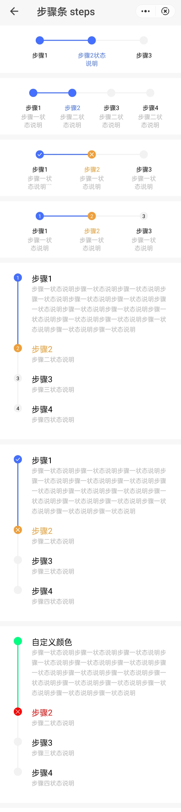

## 步骤条 steps

### 描述

显示任务的进度/引导用户完成某些操作

### 使用效果

<div style="text-align: center;margin: 40px;"></div>

### 使用方法

在`.ux`文件中引入组件

```html
<import name="q-steps" src="qaui/src/components/steps/index"></import>
<import name="q-step" src="qaui/src/components/step/index"></import>
```

### 示例

```html
<template>
  <div class="qaui-steps">
    <div class="qaui-steps-wrapper">
      <q-steps direction="row" id="11" current="{{1}}">
        <q-step title="步骤1" group-id="11"></q-step>
        <q-step title="步骤2状态说明" group-id="11"></q-step>
        <q-step title="步骤3" group-id="11"></q-step>
      </q-steps>
    </div>
    <div class="qaui-steps-wrapper">
      <q-steps direction="row" id="12" current="{{1}}">
        <q-step title="步骤1" group-id="12" content="步骤一状态说明"></q-step>
        <q-step title="步骤2" content="步骤二状态说明" group-id="12"></q-step>
        <q-step title="步骤3" content="步骤二状态说明" group-id="12"></q-step>
        <q-step title="步骤4" content="步骤二状态说明" group-id="12"></q-step>
      </q-steps>
    </div>
    <div class="qaui-steps-wrapper">
      <q-steps direction="row" id="16" current="{{1}}" has-icon="{{true}}">
        <q-step title="步骤1" group-id="16" content="步骤一状态说明"></q-step>
        <q-step
          title="步骤2"
          group-id="16"
          content="步骤一状态说明"
          status="error"
        ></q-step>
        <q-step title="步骤3" group-id="16" content="步骤一状态说明"></q-step>
      </q-steps>
    </div>
    <div class="qaui-steps-wrapper">
      <q-steps direction="row" id="17" current="{{1}}" has-text="{{true}}">
        <q-step title="步骤1" group-id="17" content="步骤一状态说明"></q-step>
        <q-step
          title="步骤2"
          group-id="17"
          content="步骤一状态说明"
          status="error"
        ></q-step>
        <q-step title="步骤3" group-id="17" content="步骤一状态说明"></q-step>
      </q-steps>
    </div>
    <div class="qaui-steps-wrapper">
      <q-steps direction="column" id="13" current="{{1}}" has-text="{{true}}">
        <q-step
          title="步骤1"
          content="步骤一状态说明步骤一状态说明步骤一状态说明步骤一状态说明步骤一状态说明步骤一状态说明步骤一状态说明步骤一状态说明步骤一状态说明步骤一状态说明步骤一状态说明步骤一状态说明步骤一状态说明步骤一状态说明步骤一状态说明"
          group-id="13"
        ></q-step>
        <q-step
          title="步骤2"
          content="步骤二状态说明"
          group-id="13"
          status="error"
        ></q-step>
        <q-step title="步骤3" content="步骤三状态说明" group-id="13"></q-step>
        <q-step title="步骤4" content="步骤四状态说明" group-id="13"></q-step>
      </q-steps>
    </div>
    <div class="qaui-steps-wrapper">
      <q-steps direction="column" id="18" current="{{1}}" has-icon="{{true}}">
        <q-step
          title="步骤1"
          content="步骤一状态说明步骤一状态说明步骤一状态说明步骤一状态说明步骤一状态说明步骤一状态说明步骤一状态说明步骤一状态说明步骤一状态说明步骤一状态说明步骤一状态说明步骤一状态说明步骤一状态说明步骤一状态说明步骤一状态说明"
          group-id="18"
        ></q-step>
        <q-step
          title="步骤2"
          content="步骤二状态说明"
          group-id="18"
          status="error"
        ></q-step>
        <q-step title="步骤3" content="步骤三状态说明" group-id="18"></q-step>
        <q-step title="步骤4" content="步骤四状态说明" group-id="18"></q-step>
      </q-steps>
    </div>
    <div class="qaui-steps-wrapper">
      <q-steps
        direction="column"
        id="14"
        error-color="#FF0000"
        finished-color="#00FF80"
        current="{{1}}"
      >
        <q-step
          title="自定义颜色"
          content="步骤一状态说明步骤一状态说明步骤一状态说明步骤一状态说明步骤一状态说明步骤一状态说明步骤一状态说明步骤一状态说明步骤一状态说明步骤一状态说明步骤一状态说明步骤一状态说明步骤一状态说明步骤一状态说明步骤一状态说明"
          group-id="14"
        ></q-step>
        <q-step
          title="步骤2"
          icon="close"
          content="步骤二状态说明"
          group-id="14"
          status="error"
        ></q-step>
        <q-step title="步骤3" content="步骤三状态说明" group-id="14"></q-step>
        <q-step title="步骤4" content="步骤四状态说明" group-id="14"></q-step>
      </q-steps>
    </div>
    <div class="qaui-steps-wrapper">
      <q-steps
        direction="column"
        id="15"
        error-color="#FF0000"
        finished-color="#00FF80"
        current="{{ current }}"
      >
        <q-step
          title="步骤1"
          content="步骤一状态说明步骤一状态说明步骤一状态说明步骤一状态说明步骤一状态说明步骤一状态说明步骤一状态说明步骤一状态说明步骤一状态说明步骤一状态说明步骤一状态说明步骤一状态说明步骤一状态说明步骤一状态说明步骤一状态说明"
          group-id="15"
        ></q-step>
        <q-step title="步骤2" content="步骤二状态说明" group-id="15"></q-step>
        <q-step title="步骤3" content="步骤三状态说明" group-id="15"></q-step>
        <q-step title="步骤4" content="步骤四状态说明" group-id="15"></q-step>
      </q-steps>
    </div>
    <div class="qaui-steps-button">
      <q-button class="button" type="ghost" ontap="changeStatus"
        >下一步</q-button
      >
    </div>
  </div>
</template>
```

```js
export default {
  data() {
    return {
      current: 0,
    }
  },

  changeStatus() {
    this.current = this.current + 1
  },
}
```

```less
.qaui-steps {
  background-color: #f7f7f7;
  flex-direction: column;

  &-wrapper {
    background-color: #ffffff;
    padding-bottom: 10px;
    margin-bottom: 10px;
  }

  &-button {
    align-self: center;
    margin-bottom: 10px;
  }
}
```

### steps 组件属性

| 属性          | 类型    | 默认值   | 说明                                |
| ------------- | ------- | -------- | ----------------------------------- |
| current       | Number  | 0        | 当前步骤，从 0 开始                 |
| direction     | String  | 'row'    | 排列方式，可选值为 'row' \|'column' |
| id            | String  | ''       | ID，必填                            |
| hasText       | Boolean | false    | 步骤是否显示默认样式的数字          |
| hasIcon       | Boolean | false    | 步骤是否默认样式的 icon             |
| finishedColor | String  | \#456FFF | 自定义的 finished 状态的颜色        |
| errorColor    | String  | \#F19E38 | 自定义的 error 状态的颜色           |

### step 组件属性

| 属性    | 类型   | 默认值    | 说明                                                             |
| ------- | ------ | --------- | ---------------------------------------------------------------- |
| status  | String | 'waiting' | step 的当前状态：'waiting' \| 'proceed' \| 'finished' \| 'error' |
| icon    | String | ''        | icon 样式，具体样式查看 icon 组件                                |
| groupId | String | ''        | ID，必填（需与父组件的 id 保持一致）                             |
| title   | String | ''        | 自定义标题                                                       |
| content | String | ''        | 自定义内容                                                       |
