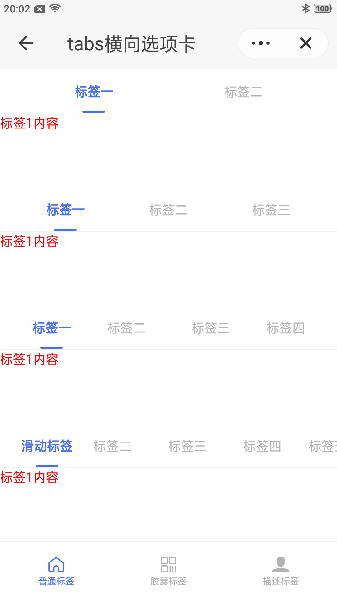
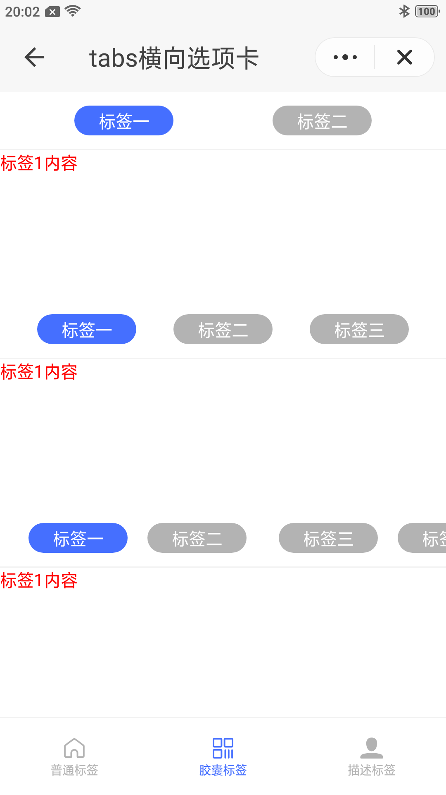

## 横向选项卡 tabs

### 描述

横向选项卡 tabs，切换操作

### 使用效果

<div style="text-align: center;margin: 40px;">
    
    
    
</div>

### 使用方法

在`.ux`文件中引入组件

```html
<import name="q-tabbar" src="qaui/src/components/tabbar/index"></import>
<import name="q-tabs" src="qaui/src/components/tabs/index"></import>
```

### 示例

```html
<template>
  <div class="qaui-wrap">
    <q-tabbar
      index="{{ index }}"
      background="{{ background }}"
      text-color="{{ textColor }}"
      active-color="{{ activeColor }}"
      data="{{ tabbarData }}"
      icon-size="{{ iconSize }}"
      ontap="changeTabbar"
    >
      <div class="item-container">
        <q-tabs
          index="0"
          type="default"
          class="q-tabs"
          data="{{ dataDefalut1 }}"
          active-color="#456fff"
          background="#FFF"
          active-background="#FFF"
          ontap="tap"
        >
          <block for="{{ dataDefalut1 }}">
            <div class="item-content">
              <text>标签{{ $idx + 1 }}内容</text>
            </div>
          </block>
        </q-tabs>
        <q-tabs
          index="0"
          type="default"
          class="q-tabs"
          data="{{ dataDefalut2 }}"
          active-color="#456fff"
          background="#FFF"
          active-background="#FFF"
          ontap="tap"
        >
          <block for="{{ dataDefalut2 }}">
            <div class="item-content">
              <text>标签{{ $idx + 1 }}内容</text>
            </div>
          </block>
        </q-tabs>
        <q-tabs
          index="0"
          type="default"
          class="q-tabs"
          data="{{ dataDefalut3 }}"
          active-color="#456fff"
          background="#FFF"
          active-background="#FFF"
          ontap="tap"
        >
          <block for="{{ dataDefalut3 }}">
            <div class="item-content">
              <text>标签{{ $idx + 1 }}内容</text>
            </div>
          </block>
        </q-tabs>
        <q-tabs
          index="0"
          type="default"
          class="q-tabs"
          data="{{ dataDefalut4 }}"
          active-color="#456fff"
          background="#FFF"
          active-background="#FFF"
          ontap="tap"
        >
          <block for="{{ dataDefalut4 }}">
            <div class="item-content">
              <text>标签{{ $idx + 1 }}内容</text>
            </div>
          </block>
        </q-tabs>
      </div>
      <div class="item-container">
        <q-tabs
          index="0"
          type="capsule"
          class="q-tabs"
          data="{{ dataDefalut1 }}"
          active-color="#fff"
          background="#b3b3b3"
          active-background="#456fff"
          ontap="tap"
        >
          <block for="{{ dataDefalut1 }}">
            <div class="item-content">
              <text>标签{{ $idx + 1 }}内容</text>
            </div>
          </block>
        </q-tabs>
        <q-tabs
          index="0"
          type="capsule"
          class="q-tabs"
          data="{{ dataDefalut2 }}"
          active-color="#fff"
          background="#b3b3b3"
          active-background="#456fff"
          ontap="tap"
        >
          <block for="{{ dataDefalut2 }}">
            <div class="item-content">
              <text>标签{{ $idx + 1 }}内容</text>
            </div>
          </block>
        </q-tabs>
        <q-tabs
          index="0"
          type="capsule"
          class="q-tabs"
          data="{{ dataDefalut3 }}"
          active-color="#fff"
          background="#b3b3b3"
          active-background="#456fff"
          ontap="tap"
        >
          <block for="{{ dataDefalut3 }}">
            <div class="item-content">
              <text>标签{{ $idx + 1 }}内容</text>
            </div>
          </block>
        </q-tabs>
      </div>
      <div class="item-container">
        <q-tabs
          index="0"
          type="desc"
          class="q-tabs"
          data="{{ dataDefalut1 }}"
          active-color="#456fff"
          active-background="#456fff"
          ontap="tap"
        >
          <block for="{{ dataDefalut1 }}">
            <div class="item-content">
              <text>标签{{ $idx + 1 }}内容</text>
            </div>
          </block>
        </q-tabs>
        <q-tabs
          index="0"
          type="desc"
          class="q-tabs"
          data="{{ dataDefalut2 }}"
          active-color="#456fff"
          active-background="#456fff"
          ontap="tap"
        >
          <block for="{{ dataDefalut2 }}">
            <div class="item-content">
              <text>标签{{ $idx + 1 }}内容</text>
            </div>
          </block>
        </q-tabs>
        <q-tabs
          index="0"
          type="desc"
          class="q-tabs"
          data="{{ dataDefalut3 }}"
          active-color="#456fff"
          active-background="#456fff"
          ontap="tap"
        >
          <block for="{{ dataDefalut3 }}">
            <div class="item-content">
              <text>标签{{ $idx + 1 }}内容</text>
            </div>
          </block>
        </q-tabs>
        <q-tabs
          index="0"
          type="desc"
          class="q-tabs"
          data="{{ dataDefalut4 }}"
          active-color="#456fff"
          active-background="#456fff"
          ontap="tap"
        >
          <block for="{{ dataDefalut4 }}">
            <div class="item-content">
              <text>标签{{ $idx + 1 }}内容</text>
            </div>
          </block>
        </q-tabs>
      </div>
    </q-tabbar>
  </div>
</template>
```

```less
<style lang="less">
.qaui-wrap {
  flex-direction: column;
}

.item-container {
  flex-direction: column;
  justify-content: flex-start;
  height: 100px;
}
.item-content {
  flex-direction: column;
  text {
    color: red;
    font-size: 14px;
  }
}
</style>
```

```js
<script>
export default {
  data() {
    return {
      dataDefalut1: [
        { label: '标签一', describe: '描述一' },
        { label: '标签二', describe: '描述二' }],
      dataDefalut2: [
        { label: '标签一', describe: '描述一' },
        { label: '标签二', describe: '描述二' },
        { label: '标签三', describe: '描述三' }],
      dataDefalut3: [
        { label: '标签一', describe: '描述一' },
        { label: '标签二', describe: '描述二' },
        { label: '标签三', describe: '描述三' },
        { label: '标签四', describe: '描述四' }],
      dataDefalut4: [
        { label: '滑动标签', describe: '描述一' },
        { label: '标签二', describe: '描述二' },
        { label: '标签三', describe: '描述三' },
        { label: '标签四', describe: '描述四' },
        { label: '标签五', describe: '描述五' }],
      tabbarData: [
        {
          icon: 'homepage',
          iconPath: '../../common/images/tabIcon.svg',
          selectedIconPath: '../../common/images/tabSelectIcon.svg',
          text: '普通标签',
        },
        {
          icon: 'qrcode',
          iconPath: '../../common/images/tabIcon.svg',
          selectedIconPath: '../../common/images/tabSelectIcon.svg',
          text: '胶囊标签',
        },
        {
          icon: 'contact-fill',
          iconPath: '../../common/images/tabIcon.svg',
          selectedIconPath: '../../common/images/tabSelectIcon.svg',
          text: '描述标签',
        },
      ],
      index: 0,
      iconSize: 22,
      background: '#fff',
      activeColor: '#456FFF',
      textColor: '#B2B2B2',

    }
  },
  tap(evt) {
    console.log(evt.detail)
  },
  changeTabbar(evt) {
    console.log('changeTabbar', evt.detail)
  }
}
</script>
```

### 组件属性

| 属性             | 类型   | 默认值    | 说明                                                                                                                        |
| ---------------- | ------ | --------- | --------------------------------------------------------------------------------------------------------------------------- |
| index            | String | '0'       | 当前选中标签的索引,默认为 0                                                                                                 |
| type             | String | 'default' | 标签类型,必填. 可选值有 'default , capsule , desc'                                                                          |
| activeColor      | String | '#456FFF' | 激活时标签的文字颜色                                                                                                        |
| background       | String | '#fff'    | 标签背景颜色                                                                                                                |
| activeBackground | String | '#fff'    | 激活时标签背景颜色(当 `type=desc` 时，指描述内容背景颜色)                                                                   |
| data             | Array  | [ ]       | data 数据对象数组，对象数据结构见下表。注意：普通标签超过 4 个,可滑动，胶囊标签超过 3 个，可滑动。描述标签超过 4 个，可滑动 |

data 内对象的属性说明

| 属性  | 类型   | 默认值 | 说明                                    |
| :---- | :----- | :----- | :-------------------------------------- |
| label | String | -      | 标签文字，必填                          |
| desc  | String | -      | 标签描述文字，仅当`type为capsule`时有效 |

### 组件事件

| 事件名称 | 事件描述       | 返回值                              |
| -------- | -------------- | ----------------------------------- |
| tap      | 切换标签时触发 | {detail：{index: 当前点击项的索引}} |
